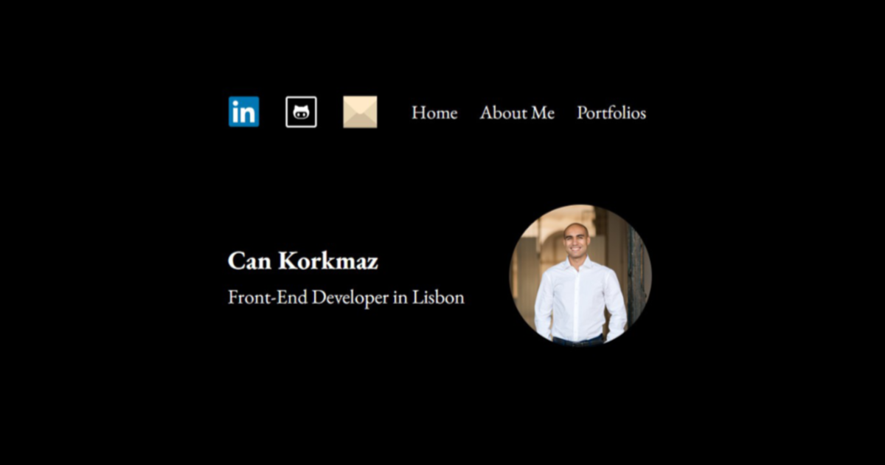

# Front-End Developer Portfolio

A responsive personal portfolio website built from scratch with semantic HTML, modern CSS, and vanilla JavaScript to present my front-end skills, professional experience, education, and project work.

[View the live website](https://vanilla-js-cv-portfolio.netlify.app/)



## Highlights

- Responsive single-page layout for desktop, tablet, and mobile screens
- Semantic page structure with dedicated about, education, portfolio, experience, and contact sections
- Scroll-triggered reveal animations powered by the Intersection Observer API
- Progressive enhancement so core content remains visible when JavaScript is unavailable
- Reduced-motion support for users who prefer fewer animations
- Keyboard-accessible navigation with visible focus states and a skip-to-content link
- Descriptive image alternatives, associated form labels, and accessible external-link labels
- SEO metadata, canonical URL, Open Graph tags, and Twitter card metadata
- Social, GitHub, email, project, and live-demo links
- Contact form that prepares a prefilled message in the visitor's default email client
- Web app manifest, favicons, and social-sharing preview assets
- No framework, package manager, or build step required

## Tech stack

### Frontend

- HTML5
- CSS3
- JavaScript (ES6+)

### Browser APIs and platform features

- Intersection Observer API
- Native HTML form validation
- CSS custom properties
- Responsive media queries
- `prefers-reduced-motion`
- Open Graph and Twitter card metadata
- Web app manifest

### Deployment

- Netlify

## Project structure

```text
index.html              Page content, semantic structure, metadata, and contact-form logic
styles.css              Layout, typography, responsive styling, interaction states, and animations
responsive.js           Intersection Observer-based reveal animations
media/                  Profile image, project artwork, favicons, manifest, and sharing preview
LICENSE                 MIT License
notes.txt               Small project notes
```

## Run locally

This is a static website with no dependencies or build process.

Clone the repository:

```bash
git clone https://github.com/RestartGamer/portfolio-website-vanilla.git
cd portfolio-website-vanilla
```

Open `index.html` directly in a browser, or serve the project through a local HTTP server.

Using Python:

```bash
python -m http.server 8000
```

Then open `http://localhost:8000`.

Using the VS Code Live Server extension is also suitable for local development.

## Implementation details

### Responsive layout

The interface uses flexible containers, wrapping layouts, percentage-based widths, maximum content widths, and breakpoint-specific adjustments to remain readable across different screen sizes.

### Motion and progressive enhancement

Elements marked with the `animated` class are observed with the Intersection Observer API. When they enter the viewport, JavaScript applies an active state that reveals them with a subtle transition.

The document starts with a `no-js` class and replaces it with `js` when scripting is available. A `<noscript>` fallback ensures animated content remains visible without JavaScript.

### Accessibility

The project includes:

- A skip link that moves keyboard users directly to the main content
- Semantic landmarks including `nav`, `header`, `main`, and `section`
- Visible keyboard focus styles
- Form labels connected to their fields
- Required-field and email-format validation through native HTML
- Meaningful alternative text for content images
- Empty alternative text for decorative linked icons with accessible link labels
- A reduced-motion mode that disables transitions and reveal effects

### SEO and sharing

The document head includes:

- A descriptive page title and meta description
- Canonical URL and indexing directives
- Open Graph title, description, URL, and preview image
- Twitter summary-card metadata
- Favicons, an Apple touch icon, and a web app manifest

### Contact flow

Submitting the contact form collects the entered name, email address, and message, URL-encodes the content, and opens a prefilled email draft addressed to the portfolio owner through a `mailto:` URL.

Because this approach relies on the visitor's configured email application, a production expansion could replace it with a serverless function or form service for in-page submission and delivery confirmation.

## Featured project

### Mangata & Gallo Jewelry Website UI

A responsive jewelry e-commerce interface created as part of a front-end development program. The portfolio links to the deployed experience and presents the project alongside its core technologies.

- [View live project](https://can-k-portfolio.netlify.app/)

## Deployment

The project can be deployed to any static hosting platform, including Netlify, GitHub Pages, Vercel, or Cloudflare Pages.

For Netlify, publish the repository root because `index.html` is already located at the top level. No build command or output directory is required.

Before deploying a fork, update the following values in `index.html`:

- Canonical URL
- Open Graph URL and image URL
- Twitter preview image URL
- LinkedIn, GitHub, and email links
- Contact-form recipient address

## Possible next steps

- Replace the `mailto:` contact flow with a serverless or API-backed form
- Host third-party icons locally to reduce reliance on external asset providers
- Add automated HTML, CSS, accessibility, and link checks
- Add more case studies with problem, process, implementation, and outcome sections
- Add explicit project repository links alongside live-demo links

## License

This project is available under the [MIT License](LICENSE).
